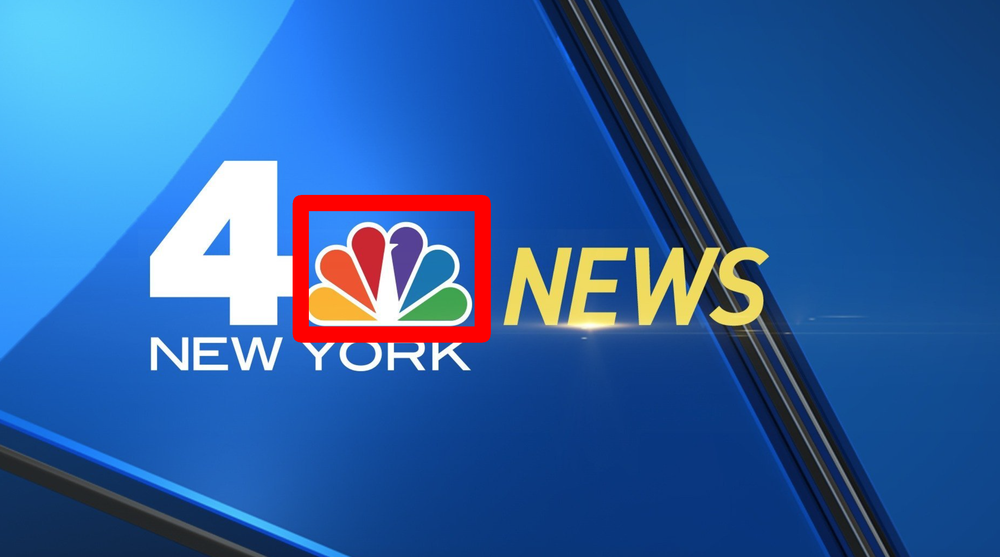
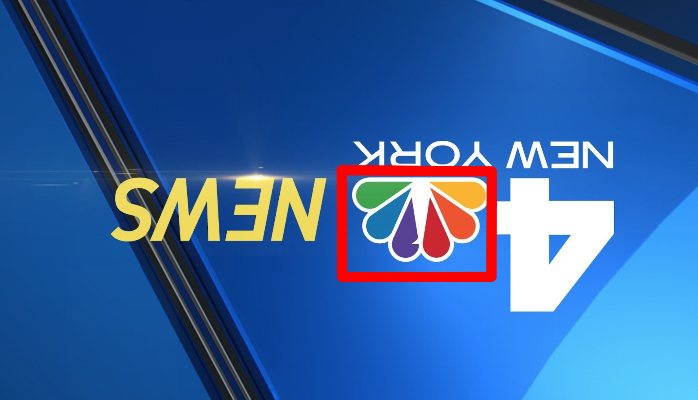

# LogoDetector

Simple demos for logo detection using template maching and feature matching based on open-cv.

## Template Matching

Template matching is a naive solution, the basic idea is to slide the template image inside the source image, and for each slide step compute and memorize the maximum similarity, which is used as the final output.

Pros:
* easy, fast, straightforward
* can handle variations in translation, scaling (perhaps some kind of transparency or minor distotion)

Cons:
* due to its nature, cannot handle rotation. (we can similarly rotate the template as a workround)
* template matching itself does not tell us if an object appear in an image or not. Need to tune a threshold parameter on the correlation coefficient for this purpose

Demo result:

## Key Matching

Different from template matching which directly slides the template image, key point matching first extracts features (keypoints and its description), and then tries to establish a mapping between the source features and template features.

Pros:
* the major advantage is that this solution is local feature invariant, robust to rotation, scaling, etc.

Cons:
* sometimes, it does not work well due to mismatch or not enough correct match. (try test with cnn-news-small.png)
* also this alg has some kind of randomness due to random sample consensus (RANSAC)
* also need to tune other params like how many good matches suffice to infer an object exist

Demo result:

# References

* https://docs.opencv.org/4.x/d1/de0/tutorial_py_feature_homography.html
* https://pyimagesearch.com/2015/01/26/multi-scale-template-matching-using-python-opencv/

